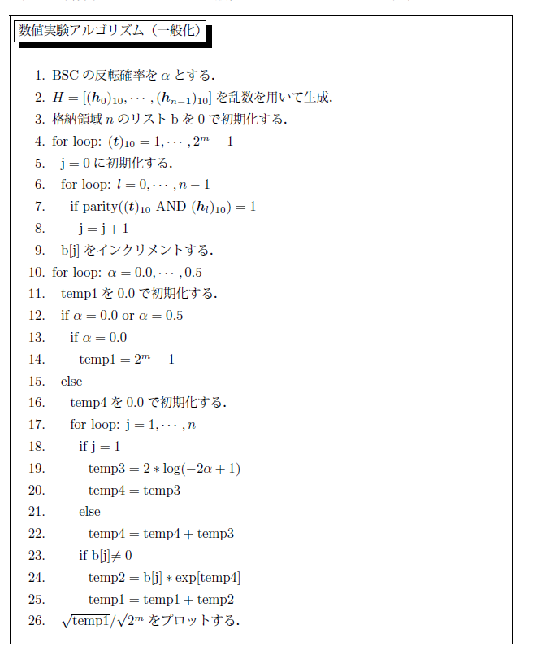
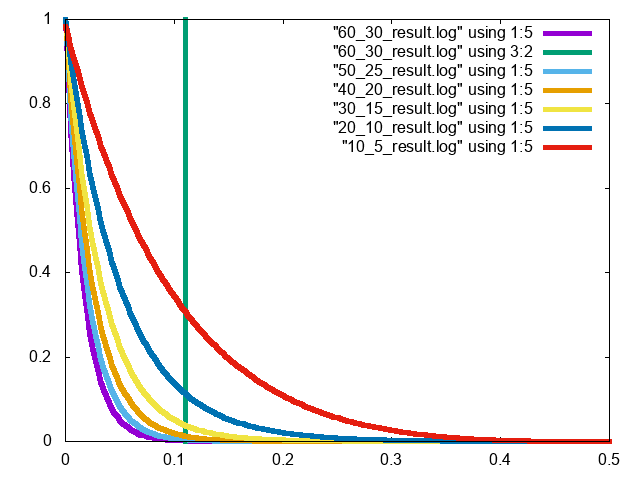
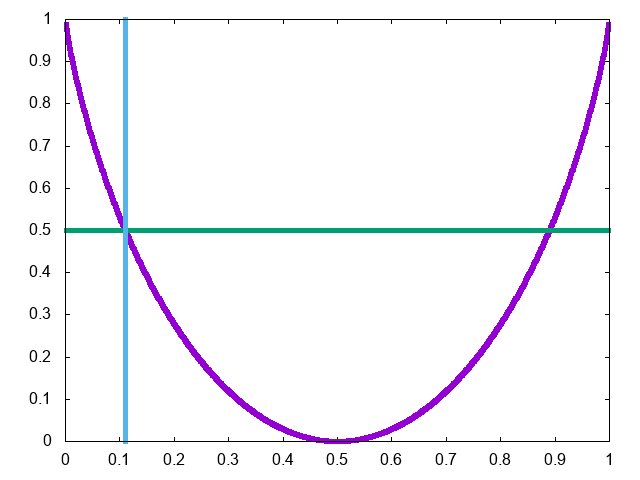
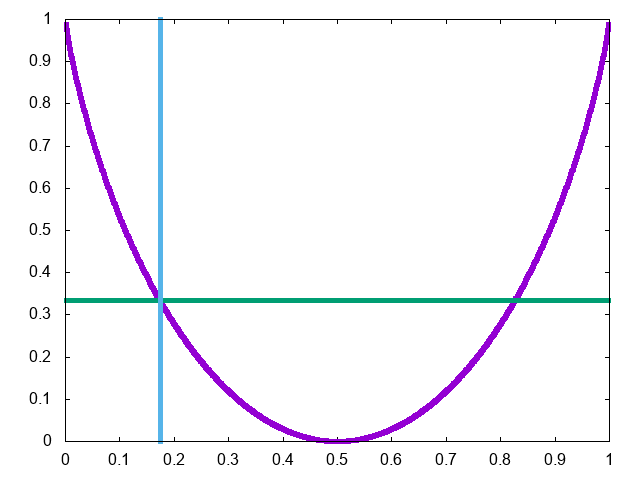
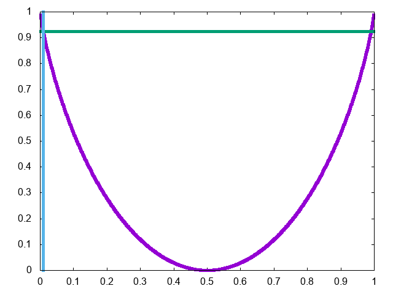

# はじめに
このリポジトリは論文「盗聴通信路符号化における特性関数を用いた安全性評価について」の再現実験をするためのリポジトリです。

# 論文要約

現在最もよく使われているRSA暗号や楕円曲線暗号は、計算量的安全性に基づく公開鍵暗号系に分類される。汎用量子コンピュータが実現した場合、Shor のアルゴリズム(1994)
により素因数分解問題や離散対数問題が多項式時間で解かれてしまうため、RSA暗号等の安全性が崩れることが理論的に知られている。近年、汎用量子コンピュータの開発研究に
おいて、量子デバイスのブレイクスルーが起こっている。今後20年程度の間に汎用量子コンピュータが実現される見込みが高い。
Wynerの盗聴通信路符号化によれば、正規受信者と盗聴者が用いる通信路のノイズ差が利用出来る状況においては、盗聴者に対する完全秘匿を確保しながら正規受信者に誤りなく
メッセージや秘密鍵を伝送する符号化が可能になる。
理論的には、符号長を大きくして安全な符号を生成出来ることが分かっている。ただし、生成された符号が「実際に安全かどうか」を確認するための手段が理論的に与えられていない。
本研究では、情報理論的安全性に基づく暗号系の一つである盗聴通信路符号化をコセット符号化を用いて実現させるために、特性関数を用いて安全性評価を行うという方法を提案する。
本研究ではファネス型不等式を用いて、盗聴者の持つ情報と一様分布の1-normを経由したエントロピーによる安全性評価を行う方法を提案した。
さらに、確率分布の1-normを具体的に計算することは一般に困難なので、確率分布の1-normを直接計算する代わりに、多変数特性関数の2-normで強安全性を用いた安全性評価を行う方法を提案する。
その結果、計算量の大幅な削減を行うことができるということがわかり、数値実験によりその優位性を示した。


# 提案アルゴリズム 



※BSCは反転確率αの二元対称通信路を表す。

# プログラム

提案アルゴリズムにて実装したプログラムをのせる。

GCCのビルトイン関数を使用しているため、GCCでコンパイルすること。

intel CPUだとNehalemマイクロアーキテクチャ以降を使用すること。AMDの場合は各自で調べること。

https://en.wikipedia.org/wiki/SSE4#POPCNT_and_LZCNT


``` ./src/mori_shuron.c 以下を編集
/*check: user check data N, K, DUMP_NAME, H_DUMP_NAME, TIMES*/
//==============================
#define N 400  //check
#define K 370 //check
#define M N-K  

/*name: ./result/N_K_result.log*/
#define DUMP_NAME "./result/400_370_result.log" //check
#define H_DUMP_NAME "./result/400_370_result_h.log" //check

#define TIMES 5  //check
//==============================
```
検査行列HがN×(N-K)行列

M:=N-K

DUMP_NAME: 提案アルゴリズムの実行結果をダンプするファイル名 

命名規則：./result/[N]_[K]_result.log

H_DUMP_NAME: 提案アルゴリズムの実行結果で選んだ検査行列Hをダンプするファイル名

命名規則： ./result/[N]_[K]_result_h.log

TIMES: ランダムコーディングを実行する回数、デフォルトだと5が設定

**コンパイル**

```
make
```
**プログラムの実行**

```
./mori_shuron
```

# プロット

**resultディレクトリへ移動**

```
cd ./result
```

例えば、gnuplotだと以下のように実行すればよい。

```
plot "60_30_result.log" using 1:5 w l lw 5, "60_30_result.log" using 3:2 w l lw 5, "50_25_result.log" using 1:5 w l lw 5, "40_20_result.log" using 1:5 w l lw 5, "30_15_result.log" using 1:5 w l lw 5, "20_10_result.log" using 1:5 w l lw 5, "10_5_result.log" using 1:5 w l lw 5  
```



# プレセットデータ

| N | K | K/N | 理論値 |
| ---- | ---- | ---- | ---- |
| 60 | 30 | 0.5 | 0.11 |
| 50 | 25 | 0.5 | 0.11 |
| 40 | 20 | 0.5 | 0.11 |
| 30 | 15 | 0.5 | 0.11 |
| 20 | 10 | 0.5 | 0.11 |
| 10 | 5 | 0.5 | 0.11 |
| 60 | 20 | 0.333 | 0.174 |
| 400 | 370 | 0.925 | 0.009 |

水色のデータ：理論値

緑色のデータ：K/N

紫色のデータ：1-h(α)

ただし、h()は二値エントロピー関数とする。

N=60, K=30



N=60, K=20



N=400, K=370



自分でデータを追加する場合はこれらのデータを自分で用意する必要がある。

``` ./src/mori_shuron.c
/*if: preset*/
#if (N==80 && K==40) || (N==70 && K==35) || (N==60 && K==30) || (N==50 && K==25) || (N==40 && K==20) || (N==30 && K==15) || (N==20 && K==10) || (N==10 && K==5) 
#define THEORY 0.11

#elif N==400 && K==370
#define THEORY 0.009

#elif N==60 && K==20
#define THEORY 0.174

/*preset to add here*/
#endif
```

# コメント

現在、数学のリハビリ中。

20201228

ビルトイン関数はgccとclangで同じ構文のものが使用できるらしいので、

Makefileを修正して、clangのversionも追記して(n,k)=(400, 370)で実行してみたところ、

clangの方が7分程、gccが20分程で計算が終わった。

この違いはなんだろうか。。

インテルコンパイラ欲しい。

# 参考文献

https://uec.repo.nii.ac.jp/?action=pages_view_main&active_action=repository_view_main_item_detail&item_id=8712&item_no=1&page_id=13&block_id=21
